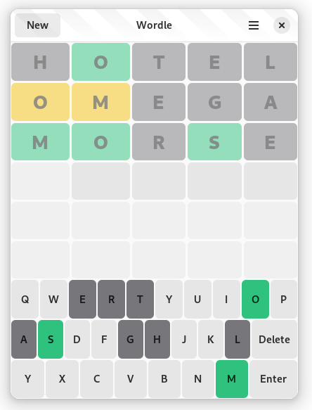
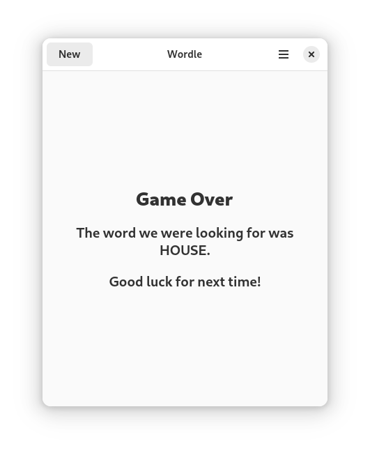

# Words!

**Words!** is similar to a popular word puzzle game where players try to guess a hidden word within six attempts. It's simple yet addictive, combining logic, vocabulary, and deduction. Here's a breakdown of the game:

## Gameplay
1. **Objective**:
   - Guess the secret five-letter word (set by the game) in six or fewer tries.

2. **How it Works**:
   - The player enters a word as a guess. One can also use Ctrl+Return for entering a word.
   - After each guess, the game provides feedback for each letter:
     - **Green**: The letter is in the correct position.
     - **Yellow**: The letter is in the word but in the wrong position.
     - **Gray**: The letter is not in the word at all.
   - Using this feedback, the player refines their guesses.

3. **Rules**:
   - Each guess must be a valid five-letter word (not random letters).
   - You cannot reuse an exact guess from before.
   - The goal is to deduce the correct word within the six allowed attempts.

## Current State of Development

Currently it's just the first released version and I'm also still learning. There fore a lot of things are missing (See issues).

Help is always welcome!

## Credits

- [gtk-rs](https://gtk-rs.org/)
- [relm4](https://relm4.org/)
